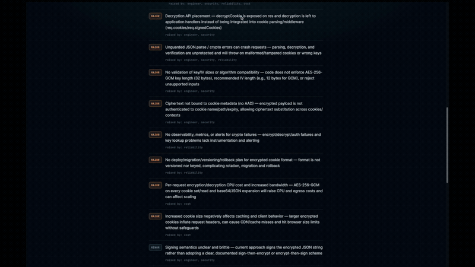

# VerdictLab

**An AI design-review panel.** Paste a design document or a GitHub PR URL, and a panel of specialized AI reviewers critiques it over a shared transcript — then a Chair synthesizes their discussion into a structured verdict: **SHIP**, **NEEDS WORK**, or **BLOCKED**.

🔗 **Live demo:** https://teardown-lq2q.onrender.com



---

## What it does

VerdictLab runs a multi-agent review instead of a single AI opinion. Each reviewer is a distinct persona with its own focus; they critique in turn over a shared transcript, so later reviewers can react to earlier ones. A Chair then weighs the discussion and returns a single structured decision.

- **Input:** a pasted design doc / RFC / architecture description, **or** a public GitHub Pull Request URL.
- **Panel:** Skeptical Senior Engineer, Security Reviewer, SRE / Reliability Reviewer, Cost / Infra Reviewer.
- **Output:** a JSON verdict (`SHIP` / `NEEDS WORK` / `BLOCKED`) with severity-tagged findings (`BLOCKER` / `MAJOR` / `MINOR`), which reviewers raised each, and open questions.

## Features

- **Review modes** — Full Design Review, Security-only, Pre-mortem, and Ship-readiness. The mode decides which reviewers run and how the Chair frames its decision.
- **Strictness dial** — Lenient / Standard / Strict, independent of mode. Tunes how harshly the panel grades and how readily the Chair escalates to BLOCKED.
- **GitHub PR review** — fetches a PR's metadata and diff and reviews it like a design doc.
- **Live streaming** — reviewers stream into the UI one at a time as they finish (Server-Sent Events), instead of one long wait.
- **Persistent history** — every review is saved to PostgreSQL and retrievable by id.
- **Hardened API** — `helmet`, CORS, and per-route rate limiting on all LLM-backed endpoints.

## How it works

1. You submit a document (or PR URL) and choose a **mode** and **strictness**.
2. The active reviewers critique the document in sequence, each appending to a **shared transcript** so the panel builds on itself rather than repeating.
3. The **Chair** reads the full transcript and produces a structured JSON verdict, deduplicating findings and attributing each to the reviewers who raised it.
4. The result is streamed to the UI and persisted to the database.

## Tech stack

| Layer | Technology |
| --- | --- |
| Backend | Node.js, Express 5 (ES modules) |
| Frontend | React, Vite |
| Database | PostgreSQL (via `pg`) |
| LLM | OpenAI (`gpt-5-mini` by default, configurable) |
| Hardening | `helmet`, `cors`, `express-rate-limit` |
| Deployment | Render |

## Getting started

### Prerequisites

- Node.js 18+ and npm
- A PostgreSQL database (a hosted instance such as Supabase, or a local Postgres)
- An OpenAI API key

### 1. Clone and install

```bash
git clone https://github.com/MarcoD-05/teardown.git
cd teardown

# backend dependencies
npm install

# frontend dependencies
cd client && npm install && cd ..
```

### 2. Configure environment

Copy the example file and fill in your values:

```bash
cp .env.example .env
```

See [Environment variables](#environment-variables) below for what each one does.

### 3. Initialize the database

Creates the `reviews` and `findings` tables:

```bash
npm run db:init
```

### 4. Run it (two terminals)

The backend API and the Vite dev server run side by side. Vite proxies API calls to the backend.

```bash
# Terminal 1 — backend API on http://localhost:3000
npm run dev

# Terminal 2 — frontend on http://localhost:5173
cd client && npm run dev
```

Open **http://localhost:5173** in your browser. (Visiting `http://localhost:3000` directly will show "Cannot GET /" in development — that's expected; the API has no homepage locally. The frontend lives on `:5173`.)

### Production build

The `build` script installs dependencies and builds the React client; Express then serves the built files:

```bash
npm run build
npm start
```

## Environment variables

| Variable | Required | Default | Description |
| --- | --- | --- | --- |
| `OPENAI_API_KEY` | Yes | — | Your OpenAI API key. |
| `DATABASE_URL` | Yes | — | PostgreSQL connection string. |
| `GITHUB_TOKEN` | For PR review | — | GitHub token used to fetch PRs. Without it, PR review may be rate-limited or rejected (401). |
| `OPENAI_MODEL` | No | `gpt-5-mini` | The OpenAI chat model to use. |
| `PORT` | No | `3000` | Port the API listens on. |
| `NODE_ENV` | No | `development` | `development` or `production`. |

> **Note:** `.env` is gitignored and must never be committed. Keep secrets local and set them separately in your deployment environment.

## API reference

| Method | Route | Description |
| --- | --- | --- |
| `GET` | `/health` | Health check. |
| `GET` | `/modes` | List available review modes. |
| `GET` | `/strictness` | List available strictness levels. |
| `POST` | `/review` | Review a pasted document. Body: `{ document, mode, strictness }`. |
| `POST` | `/review-pr` | Review a GitHub PR. Body: `{ prUrl, mode, strictness }`. |
| `POST` | `/review-stream` | Streaming review (SSE). Body: `{ document` **or** `prUrl, mode, strictness }`. |
| `POST` | `/debate` | Run an advocate-vs-skeptic debate on a decision. |
| `GET` | `/reviews` | List saved reviews. |
| `GET` | `/reviews/:id` | Fetch a saved review by id. |

## Project structure

```
.
├── src/                  # Backend (Node / Express)
│   ├── server.js         # Express app: routes, static serving, rate limiting
│   ├── llm.js            # OpenAI wrapper (askLLM)
│   ├── reviewers.js      # Reviewer personas + Chair + debaters
│   ├── review.js         # runReview: shared-transcript loop + Chair synthesis
│   ├── debate.js         # runDebate: advocate vs skeptic
│   ├── modes.js          # Review modes
│   ├── strictness.js     # Strictness levels
│   ├── github.js         # Fetch a GitHub PR as a reviewable document
│   ├── db.js             # PostgreSQL connection pool
│   ├── reviews-repo.js   # Save / fetch / list reviews
│   ├── schema.sql        # Table definitions
│   └── init-db.js        # Schema bootstrap (npm run db:init)
└── client/               # Frontend (React + Vite)
    └── src/
        ├── App.jsx       # Main UI
        └── App.css
```

## License

ISC